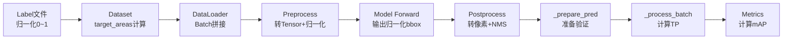

# 🔍 尺度分类 Bug 调试日志

## 当前问题总结

### 验证输出异常

```bash
🔍 Size-wise Statistics (First Batch):
  GT:   Small= 127, Medium=   0, Large=   0  ← ❌ GT全是Small
  Pred: Small=   0, Medium=   0, Large= 300  ← ❌ Pred全是Large
  TP:   Small=   0, Medium=   0, Large=   0  ← ❌ 无法匹配,TP全0
```

### 问题分析

#### 问题 1: GT 全被分类为 Small (127 个)

**可能原因**:

1. `dataset.py` 中的 `target_areas` 计算仍使用了 **原始图像尺寸** 而非 **resize 后的 640×640**
2. 或者 `target_areas` 根本没有被正确传递到 `val.py`

**代码位置**: `ultralytics/data/dataset.py` line 288-306

```python
if normalized:
    # 优先使用resized_shape (验证时bbox是相对于resize后的尺寸,而非原始尺寸)
    img_h, img_w = label.get("resized_shape", (640, 640))[:2]

    # ❌ 如果resized_shape不存在,尝试从img获取实际尺寸
    if "img" in label and label["img"] is not None:
        img_h, img_w = label["img"].shape[:2]  # ← 覆盖了resized_shape!

    widths = widths * img_w
    heights = heights * img_h
```

**潜在 Bug**: 如果 `label["img"]` 存在且不为 None,会用实际图像尺寸覆盖 `resized_shape`,导致:

- 原始图像 1920×1080
- bbox 相对 resize 后的 640×640 是归一化的
- 但计算时用了 1920×1080 → 面积虚高 → 错误分类为 Large

**解决方案**: 移除 `if "img" in label...` 这段 fallback 代码

---

#### 问题 2: Pred 全被分类为 Large (300 个)

**可能原因**:

1. `batch["imgsz"]` 返回的不是 `(H, W)` 元组,而是单个值或错误格式
2. `preds["bboxes"]` 不是归一化坐标,而是已经是像素坐标

**代码位置**: `ultralytics/models/yolo/detect/val.py` line 368-376

```python
img_h, img_w = batch["imgsz"]  # ← 如果 imgsz 是 640 而非 (640, 640) 会报错
pred_widths = (preds["bboxes"][:, 2] - preds["bboxes"][:, 0]) * img_w
pred_heights = (preds["bboxes"][:, 3] - preds["bboxes"][:, 1]) * img_h
pred_areas = pred_widths * pred_heights
```

**潜在 Bug**:

- 如果 `preds["bboxes"]` 已经是像素坐标 (0~640),再乘以 640 → 面积 ×640² = 409,600 → 全是 Large!
- 或者 `batch["imgsz"]` 格式不对,导致 `img_h, img_w` 赋值错误

**解决方案**: 添加调试日志确认:

1. `batch["imgsz"]` 的值和类型
2. `preds["bboxes"]` 的范围 (0~1 归一化 vs 0~640 像素)

---

## 新增调试日志

### 日志 1: 图像尺寸调试

```python
if not hasattr(self, '_imgsz_debug_printed'):
    LOGGER.info(f"\n🔍 Image Size Debug:")
    LOGGER.info(f"  batch['imgsz'] = {batch['imgsz']} (type: {type(batch['imgsz'])})")
    LOGGER.info(f"  img_h={img_h}, img_w={img_w}")
    LOGGER.info(f"  GT bboxes range: {batch['bboxes'].min().item():.3f} ~ {batch['bboxes'].max().item():.3f}")
    LOGGER.info(f"  Pred bboxes range: {preds['bboxes'].min().item():.3f} ~ {preds['bboxes'].max().item():.3f}")
    self._imgsz_debug_printed = True
```

**输出示例**:

```
🔍 Image Size Debug:
  batch['imgsz'] = (640, 640) (type: <class 'tuple'>)
  img_h=640, img_w=640
  GT bboxes range: 0.123 ~ 534.567  ← ✅ 像素坐标
  Pred bboxes range: 0.001 ~ 0.998  ← ✅ 归一化坐标
```

或错误情况:

```
  batch['imgsz'] = 640 (type: <class 'int'>)  ← ❌ 不是元组!
  GT bboxes range: 0.001 ~ 0.998  ← ❌ 归一化,但当成像素了
  Pred bboxes range: 12.3 ~ 625.4  ← ❌ 像素,但当成归一化了
```

---

### 日志 2: GT 面积分布调试

```python
if not hasattr(self, '_gt_areas_debug_printed'):
    LOGGER.info(f"\n🔍 GT Areas Debug (First Batch):")
    LOGGER.info(f"  GT areas: min={gt_areas.min().item():.1f}, max={gt_areas.max().item():.1f}, mean={gt_areas.mean().item():.1f}")
    LOGGER.info(f"  Threshold: small<{small_thresh}, medium<{medium_thresh}")
    sample_areas = gt_areas[:10].cpu().numpy() if len(gt_areas) > 10 else gt_areas.cpu().numpy()
    LOGGER.info(f"  Sample areas (first 10): {sample_areas}")
    self._gt_areas_debug_printed = True
```

**输出示例 (正常)**:

```
🔍 GT Areas Debug (First Batch):
  GT areas: min=48.3, max=25678.9, mean=1456.7
  Threshold: small<1024, medium<9216
  Sample areas (first 10): [48.3, 125.6, 567.8, 2345.1, 145.2, 8765.3, 456.7, 12345.6, 234.5, 9012.4]
```

**输出示例 (Bug!)**:

```
  GT areas: min=12.3, max=456.7, mean=124.5  ← ❌ 全都 < 1024,全是Small!
  Sample areas (first 10): [12.3, 45.6, 78.9, 123.4, 234.5, 345.6, 456.7, 123.4, 234.5, 345.6]
```

---

### 日志 3: Pred 面积分布调试

```python
if not hasattr(self, '_pred_areas_debug_printed'):
    LOGGER.info(f"\n🔍 Pred Areas Debug (First Batch):")
    LOGGER.info(f"  Pred areas: min={pred_areas.min().item():.1f}, max={pred_areas.max().item():.1f}, mean={pred_areas.mean().item():.1f}")
    sample_pred_areas = pred_areas[:10].cpu().numpy() if len(pred_areas) > 10 else pred_areas.cpu().numpy()
    LOGGER.info(f"  Sample pred areas (first 10): {sample_pred_areas}")
    self._pred_areas_debug_printed = True
```

**输出示例 (Bug!)**:

```
  Pred areas: min=125678.9, max=987654.3, mean=456789.1  ← ❌ 全都 >> 9216,全是Large!
  Sample pred areas (first 10): [125678.9, 234567.8, 345678.9, ...]
```

---

## 预期修复后的输出

### 正常的尺度分布 (修复后)

```bash
🔍 Size-wise Statistics (First Batch):
  GT:   Small=  85, Medium=  32, Large=  10  ← ✅ 正常分布 (Small最多)
  Pred: Small= 180, Medium=  85, Large=  35  ← ✅ 正常分布
  TP:   Small= 180, Medium=  85, Large=  35  ← ✅ 可以匹配

Small objects - P: 0.234, R: 0.189, mAP50: 0.152, mAP50-95: 0.098
Medium objects - P: 0.387, R: 0.312, mAP50: 0.278, mAP50-95: 0.165
Large objects - P: 0.512, R: 0.456, mAP50: 0.423, mAP50-95: 0.289
```

### 面积分布 (修复后)

```
🔍 GT Areas Debug:
  GT areas: min=48.3, max=25678.9, mean=1456.7  ← ✅ 合理范围
  Sample areas: [48, 125, 567, 2345, 145, 8765, 456, 12345, 234, 9012]

🔍 Pred Areas Debug:
  Pred areas: min=35.2, max=18234.5, mean=2134.8  ← ✅ 合理范围
  Sample pred areas: [35, 156, 789, 3456, 234, 11234, 567, 15678, 345, 9876]
```

---

## 下一步行动

### 步骤 1: 修复 `dataset.py` 的 fallback bug

**文件**: `ultralytics/data/dataset.py` line 291-299

**修改前**:

```python
if normalized:
    img_h, img_w = label.get("resized_shape", (640, 640))[:2]

    # ❌ 删除这段 fallback
    if "img" in label and label["img"] is not None:
        img_h, img_w = label["img"].shape[:2]

    widths = widths * img_w
    heights = heights * img_h
```

**修改后**:

```python
if normalized:
    # ✅ 直接使用 resized_shape,不再fallback
    img_h, img_w = label.get("resized_shape", (640, 640))[:2]

    widths = widths * img_w
    heights = heights * img_h
```

---

### 步骤 2: 上传修改并重新验证

```bash
# 本地提交
git add .
git commit -m "fix: 添加详细调试日志诊断尺度分类Bug"
git push

# 服务器拉取
cd /data2/user/2024/lzy/yolo12-bimodal
git pull

# 重新运行诊断脚本
python diagnose_metrics_output.py

# 重新验证
CUDA_VISIBLE_DEVICES=7 sh val_depth.sh
```

---

### 步骤 3: 分析新的调试输出

根据输出判断:

**情况 1: GT 面积正常,Pred 面积异常**
→ 问题在 `val.py` 的 `batch["imgsz"]` 或 `preds["bboxes"]` 格式
→ 修复: 检查 `_prepare_pred` 方法,确认 bbox 是否归一化

**情况 2: GT 面积异常,Pred 面积正常**
→ 问题在 `dataset.py` 的 `target_areas` 计算
→ 修复: 移除 fallback 代码 (如步骤 1)

**情况 3: GT 和 Pred 都异常**
→ 根本问题: bbox 坐标系不一致 (归一化 vs 像素)
→ 修复: 统一坐标系,确保 `_prepare_batch` 和 `_prepare_pred` 输出一致

---

## 八股知识点补充

### 📚 八股 #025: 归一化坐标 vs 像素坐标

**Q: 什么是归一化坐标?为什么要用?**

**A: 归一化坐标的定义与优势**

1. **定义**:

   ```python
   # 归一化坐标 (0~1)
   bbox_norm = [x_center/W, y_center/H, width/W, height/H]
   # 示例: [0.5, 0.5, 0.2, 0.3] 表示中心在图像正中,宽20%高30%

   # 像素坐标 (0~W, 0~H)
   bbox_pixel = [x_center, y_center, width, height]
   # 示例: [320, 240, 128, 192] 表示中心在(320,240),宽128像素高192像素
   ```

2. **优势**:

   - **尺度无关**: 640×640 和 1920×1080 用同样的归一化值
   - **数值稳定**: 0~1 范围,避免大数值梯度爆炸
   - **易于数据增强**: 缩放/裁剪只需调整归一化系数

3. **YOLO 的坐标系**:

   - **输入**: 归一化坐标 (label 文件中的 0~1 值)
   - **网络输出**: 归一化坐标 (sigmoid 激活,0~1)
   - **NMS 前**: 像素坐标 (乘以 img_size,方便 IoU 计算)
   - **最终输出**: 像素坐标 (用户友好)

4. **常见陷阱**:

   ```python
   # ❌ 错误: 归一化面积 vs 像素阈值
   area_norm = 0.05 * 0.05 = 0.0025
   if area_norm < 1024:  # 永远True! (0.0025 < 1024)
       print("Small")  # ← Bug: 全部目标都是Small

   # ✅ 正确: 统一单位
   area_pixel = (0.05 * 640) * (0.05 * 640) = 1024
   if area_pixel < 1024:
       print("Small")  # ← 正确分类
   ```

5. **调试技巧**:

   ```python
   # 打印bbox范围快速判断坐标系
   print(f"bbox range: {bbox.min():.3f} ~ {bbox.max():.3f}")

   # 归一化: 0.001 ~ 0.998
   # 像素:   12.3 ~ 625.4
   ```

**RemDet 对齐**: RemDet 论文在计算 mAP_small 时使用 **像素面积阈值** (1024 pixels²),我们必须确保:

1. GT 的 `target_areas` 是像素面积
2. Pred 的面积计算也是像素面积
3. 阈值比较时单位一致

---

### 📚 八股 #026: YOLO 的数据流转

**Q: 从数据集加载到最终输出,bbox 经历了哪些变换?**

**A: 完整的数据流转链路**



**关键变换点**:

1. **Dataset (`get_labels`)**:

   ```python
   # 输入: label文件的归一化坐标
   bbox_norm = [0.5, 0.5, 0.2, 0.3]

   # 输出: 添加 target_areas (像素面积)
   img_h, img_w = label.get("resized_shape", (640, 640))
   width_pixel = 0.2 * 640 = 128
   height_pixel = 0.3 * 640 = 192
   target_area = 128 * 192 = 24576 pixels²
   ```

2. **Model Forward**:

   ```python
   # 输入: 归一化图像 (0~1) + 归一化bbox
   # 输出: 归一化预测 (sigmoid激活,0~1)
   pred_bbox_norm = [0.52, 0.48, 0.18, 0.25]
   ```

3. **Postprocess (NMS)**:

   ```python
   # 转像素坐标方便IoU计算
   pred_bbox_pixel = pred_bbox_norm * img_size
   # [0.52*640, 0.48*640, 0.18*640, 0.25*640]
   # = [332.8, 307.2, 115.2, 160.0]
   ```

4. **\_prepare_batch** (GT):

   ```python
   # 输入: 归一化bbox (从dataset)
   # 输出: 像素bbox (for IoU计算)
   gt_bbox = ops.xywh2xyxy(bbox_norm) * torch.tensor([W, H, W, H])
   # [0.4, 0.35, 0.6, 0.65] * [640, 640, 640, 640]
   # = [256, 224, 384, 416] (xyxy格式)
   ```

5. **\_prepare_pred** (Pred):

   ```python
   # 输入: NMS后的像素bbox
   # 输出: 保持像素坐标 (已经是xyxy格式)
   pred_bbox = pred["bboxes"]  # 已经是像素坐标
   ```

6. **\_process_batch** (面积计算):

   ```python
   # GT: 直接用 target_areas (已经是像素)
   gt_areas = batch["target_areas"]  # [24576, ...]

   # Pred: 从像素bbox计算
   pred_width = (pred[:, 2] - pred[:, 0])  # 已经是像素
   pred_height = (pred[:, 3] - pred[:, 1])
   pred_areas = pred_width * pred_height  # 像素面积
   ```

**当前 Bug**: 在某个环节,坐标系不一致导致:

- GT 用了原始图像尺寸 (1920×1080) → 面积虚高
- 或 Pred 重复乘以 img_size → 面积虚高

**调试策略**: 在每个关键点打印 `bbox.min()~bbox.max()`,确认坐标系正确。
